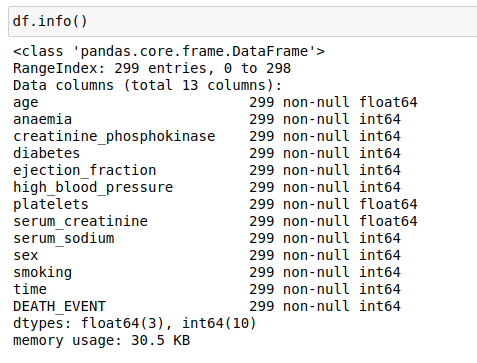
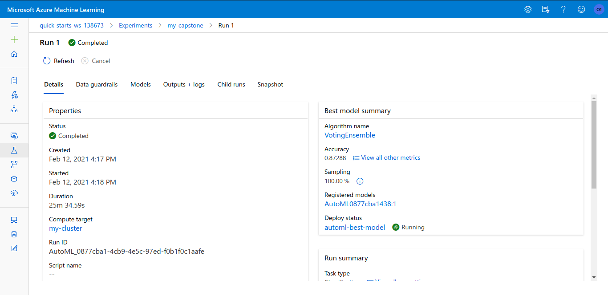

# Predict Mortality for Heart Failure

### Summary

Cardiovascular diseases (CVDs) are the number 1 cause of death globally, taking an estimated 17.9 million lives each year, which accounts for 31% of all deaths worldwide.
To goal of this project is to predict mortality by heart failure. In this project we are going to use **The Heart Failure Datasets**(1). People with cardiovascular disease or who are at high cardiovascular risk (due to the presence of one or more risk factors such as hypertension, diabetes, hyperlipidemia, or already established disease) need early detection to save their lives.

In this project, we are going to train using Azure AutoML as well as Hyperdrive. From the experiment, the best model will be deployed

## Architecture


## Project Set Up and Installation
We are using ML Azure Studio. There first we need to create computer instance. When the instance is ready, we have option to launch the  **Jupyter notebook**

## Dataset

### Overview
In this project we are going to use **The Heart Failure Dataset** and this datasets can be found in [Kaggle](https://www.kaggle.com/andrewmvd/heart-failure-clinical-data).

The Heart failure dataset has total 13 columns

- age
- anaemia
- creatinine_phosphokinase
- diabetes
- ejection_fraction
- high_blood_pressure
- platelets
- serum_creatinine
- serum_sodium
- sex
- smoking
- time
- DEATH_EVENT


Here is the datasets, information



### Task
we need to classify **DEATH_EVENT** based on the other 12 features. So, It's a classification task.

### Access
To access this datasets, we upload into the **Github** account, and using the file link, we can easily access the file. Here is the code snippets

```python
from azureml.data.dataset_factory import TabularDatasetFactory

url = "https://raw.githubusercontent.com/Iamsdt/Udacity-ML-Azure-Capstone/master/datasets/heart_failure_clinical_records_dataset.csv"

dataset = Dataset.Tabular.from_delimited_files(url)    
```


### EDA

1. First, I check the available ages in the datasets


2. Correlation among all the features

   

   

3. Relation between Age, Diabetes vs Death Event

   


## Automated ML

In **AutoML**, we used following parameters

| No.  | Title                       | Value          |
| ---- | --------------------------- | -------------- |
| 1.   | Task                        | Classification |
| 2.   | Primary Metric              | Accuracy       |
| 3.   | Number of cross validations | 5              |
| 4.   | Experiment Time out minutes | 20             |

here is the code

```
automl_settings = {
    "n_cross_validations": 5,
    "primary_metric": 'accuracy',
    "enable_early_stopping": True,
    "max_concurrent_iterations": 5,
}

# automl config
automl_config = AutoMLConfig(task = 'classification',
                            experiment_timeout_minutes=20,
                            compute_target = compute_target,
                            training_data = dataset,
                            label_column_name = 'DEATH_EVENT',
                            featurization= 'auto',
                            path = project_folder,
                            debug_log = "automl_errors.log",
                            **automl_settings)
```

Here,

- **task** -> **classificaion**, we want to determine value of DEATH_EVENT based on the other 12 features
- **primary_metric** -> **accuracy**, we choose accuracy as our primary metrics
- **max_concurrent_iterations** -> **5**, in our cluster, we have maximum 6 nodes, so we can use 5
- **experiment_timeout_minutes** = **20**, we wan to run this experiments for **20 minutes**

### Results

When the experiment is completed, we can see the model details, with RunDetails Widget. (Here **remote_run** is our submitted experiment)

```
RunDetails(remote_run).show()
```

Output:


#### Best Model:

**Voting ensemble** with 87.29 % accuracy. And Voting ensemble model works by combining the predictions from multiple models. Here is **XGBoostClassifier** details generated by **AutoML**.

Here is top 10 models, produced by auto ml.


Now we can check the metrics of the best model, here is the best metrics

```json
{'average_precision_score_micro': 0.9172347849082338,
 'recall_score_micro': 0.8728813559322035,
 'precision_score_macro': 0.8732482337353845,
 'norm_macro_recall': 0.67421788482835,
 'average_precision_score_weighted': 0.92263382495822,
 'AUC_micro': 0.9148604487854703,
 'AUC_weighted': 0.9096312292358804,
 'balanced_accuracy': 0.8371089424141751,
 'AUC_macro': 0.9096312292358804,
 'f1_score_micro': 0.8728813559322035,
 'recall_score_weighted': 0.8728813559322035,
 'log_loss': 0.3940637252605644,
 'f1_score_macro': 0.8444862091746149,
 'precision_score_weighted': 0.8817217472748613,
 'accuracy': 0.8728813559322035,
 'f1_score_weighted': 0.8684072721538373,
 'matthews_correlation': 0.7078786213911282,
 'precision_score_micro': 0.8728813559322035,
 'average_precision_score_macro': 0.899940232663685,
 'weighted_accuracy': 0.8967612729744958,
 'recall_score_macro': 0.8371089424141751,
 'accuracy_table': 'aml://artifactId/ExperimentRun/dcid.AutoML_0877cba1-4cb9-4e5c-97ed-f0b1f0c1aafe_38/accuracy_table',
 'confusion_matrix': 'aml://artifactId/ExperimentRun/dcid.AutoML_0877cba1-4cb9-4e5c-97ed-f0b1f0c1aafe_38/confusion_matrix'}
```

We also extract the parameter from the best model, by using this code

```python
best_run, fitted_model = remote_run.get_output()
fitted_model.steps[-1][-1].estimators[0]
```

Output:


Even we can get all the information from the ML studio.

Here is the screenshot of run completed with best model



If we navigate into the models section, we can find more models


### Improvement: 

To improve, we can allow more time to train this automl by changing this parameters 

```
experiment_timeout_minutes=20
```


## Hyperparameter Tuning

For this experiment, we chose **LogisticRegression** model to predict the value of the dependent variable. [**LogisticRegression**](https://en.wikipedia.org/wiki/Logistic_regression) can perform better in classification task.  To Find the best **Scitkit learn model**, we used below parameters

**For hyper parameter sampling**: we used discrete values

```
Inverse of regularization strength = [0.001,0.01,0.1,1,10,20,50,100]
Maximum number of iterations = [25,50,100,200]
```

**For Policy:**

```
evaluation_interval=2
slack_factor=0.1
```

**Hyper parameters**

| No.  | Title                    | Value                      |
| ---- | ------------------------ | -------------------------- |
| 1.   | Hyper parameter Sampling | RandomParameterSampling    |
| 2.   | Primary metric name      | Accuracy                   |
| 3.   | Primary metric goal      | PrimaryMetricGoal.MAXIMIZE |
| 4.   | Policy                   | BanditPolicy               |
| 5.   | Max Total Runs           | 20                         |
| 6.   | Max Concurrent Runs      | 5                          |

**SK Learn Model:** **Logistic Regression**

### Sampling Parameter

In this experiment, we choose **Random Parameter Sampling** which faster, efficient, time-saving, and works perfectly. On the other hand **Grid Parameter Sampling** is exhaustively searched over the search space and takes usually long times and required more computation time and power.

### Early Stopping Policy

For this experiment, we chose the ***Bandit Policy*** with following parameters:

```
policy = BanditPolicy(evaluation_interval=2, slack_factor=0.1)
```

**evaluation_interval**: The frequency for applying the policy. (**docs**)

**slack_factor**: The ratio used to calculate the allowed distance from the best performing experiment run. (**docs**)

In this policy, any run that doesn't fall within the slack factor or slack amount of the evaluation metric with respect to the best performing run will be terminated. So by using this policy, it will retain only similar or better performance models.

### Results

When the experiment is done, we can get the best parameters along with accuracy from **RunDetails** Widgets


So, here the best model parameters

```
hyperdrive_run.get_best_run_by_primary_metric()
best_run.get_metrics()
```

Output:

```
{'Regularization Strength:': 0.001, 'Max iterations:': 25, 'Accuracy': 0.9}
```

### Improvement:

1. By Changing Sampling parameters:
   - We can change the sampling parameters into **Grid Parameter Sampling**, it should take more time, it's can produce better results
2. Using Sophisticated ML model
   1. In this project, we used **Logistic regression** which is a very simple model, we can use more sophisticated model like **XGBoost**, **RandomForest**, **LightGBM**

3. Using Deep Learning
   - We can use Deep Learning to improve further.

## Model Deployment
We decided to deploy the best model generated by auto ML.

```
aci_config = AciWebservice.deploy_configuration(cpu_cores=2, memory_gb=1, auth_enabled=True, enable_app_insights=True)

deployed_service = Model.deploy(workspace=ws, 
                       name='automl-best-model',
                       inference_config=inference_config,
                       deployment_config=aci_config,
                       models=[mymodel])
```

For deployment purpose, we use 

- Cpu Cores -> 2
- Memory -> 1 GB

When the deployment is ready we can send the request to the web service.


That's means our model is deployed. Even we can the model deployment status from **ML studio**


We can get rest end point, api key and swagger json


Using the swagger json, we can get the information about the http data, we need to pass in the request


Now lets, navigate in to the consume tab, to get the api_key, then buy using following code we can send request to the server

```python
import urllib.request
import json
import os
import ssl

def allowSelfSignedHttps(allowed):
    # bypass the server certificate verification on client side
    if allowed and not os.environ.get('PYTHONHTTPSVERIFY', '') and getattr(ssl, '_create_unverified_context', None):
        ssl._create_default_https_context = ssl._create_unverified_context

allowSelfSignedHttps(True) # this line is needed if you use self-signed certificate in your scoring service.

data = {
    "data":
    [
        {
            'age': "0",
            'anaemia': "0",
            'creatinine_phosphokinase': "0",
            'diabetes': "0",
            'ejection_fraction': "0",
            'high_blood_pressure': "0",
            'platelets': "0",
            'serum_creatinine': "0",
            'serum_sodium': "0",
            'sex': "0",
            'smoking': "0",
            'time': "0",
        },
    ],
}

body = str.encode(json.dumps(data))

url = 'http://8aac4f9f-3244-4acf-8aef-634a43a637ad.southcentralus.azurecontainer.io/score'
api_key = 'yitQxuYWREfCAJ7Fa24rDB9C6aoloBKw' # Replace this with the API key for the web service
headers = {'Content-Type':'application/json', 'Authorization':('Bearer '+ api_key)}

req = urllib.request.Request(url, body, headers)

try:
    response = urllib.request.urlopen(req)

    result = response.read()
    print(result)
except urllib.error.HTTPError as error:
    print("The request failed with status code: " + str(error.code))

    # Print the headers - they include the requert ID and the timestamp, which are useful for debugging the failure
    print(error.info())
    print(json.loads(error.read().decode("utf8", 'ignore')))

```

Output:

```
b'"{\\"result\\": [1]}"'
```

Here, 1 means death event


## Screen Recording

- Screen Recording available into [Youtube](https://youtu.be/SnzlARlr_L4)

## Standout Suggestions
- we plan to convert the model into ONNX format, and the Using [ONNX Tensorflow](https://github.com/onnx/onnx-tensorflow) library we can convert the model into tensorflow model, and use this model as on device ML model in mobile app using [Flutter](https://flutter.dev/) framework.

  

## References

1. Davide Chicco, Giuseppe Jurman: Machine learning can predict survival of patients with heart failure from serum creatinine and ejection fraction alone. BMC Medical Informatics and Decision Making 20, 16 (2020). ([link](https://doi.org/10.1186/s12911-020-1023-5))